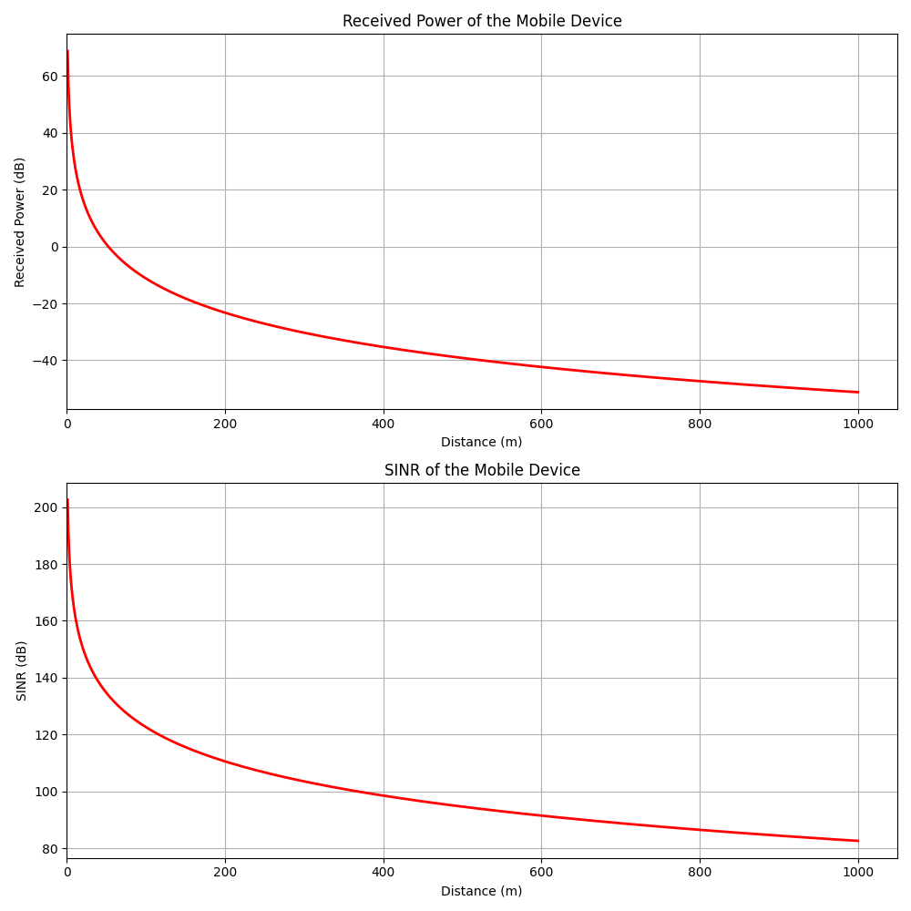
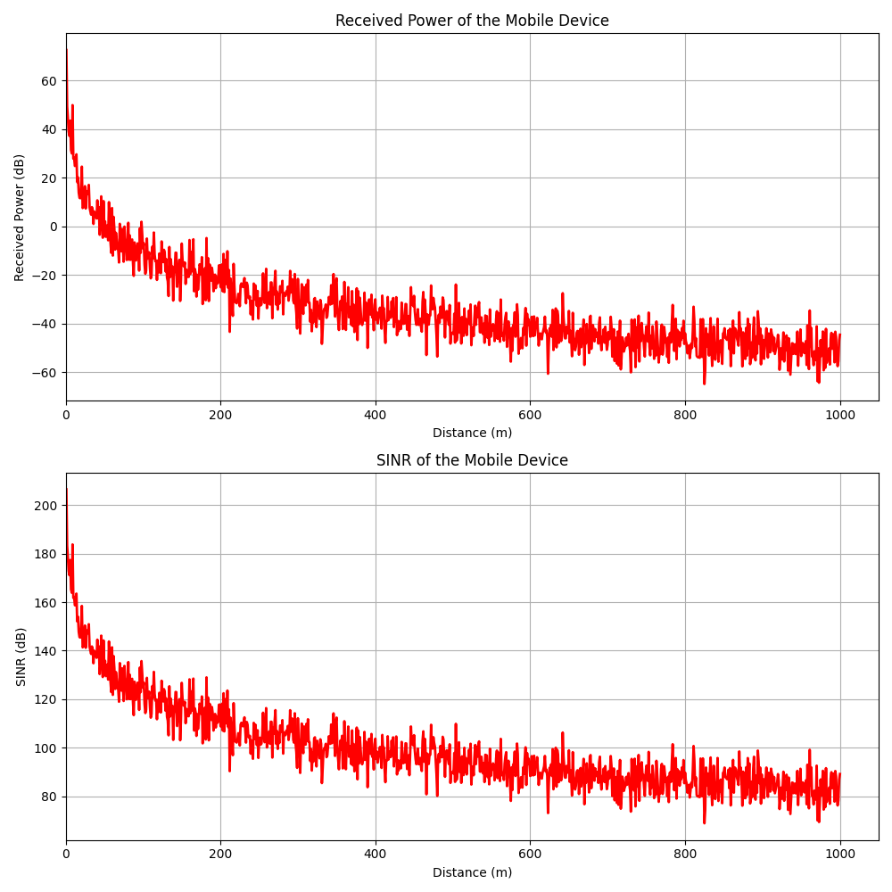

# HW1 Report
## Problem 1
For problem 1-1 and problem 1-2, please respectively refer to the upper figure and the lower figure.

## Problem 2
For problem 2-1 and problem 2-2, please respectively refer to the upper figure and the lower figure.

