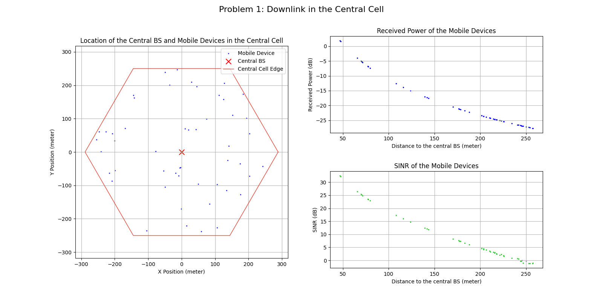
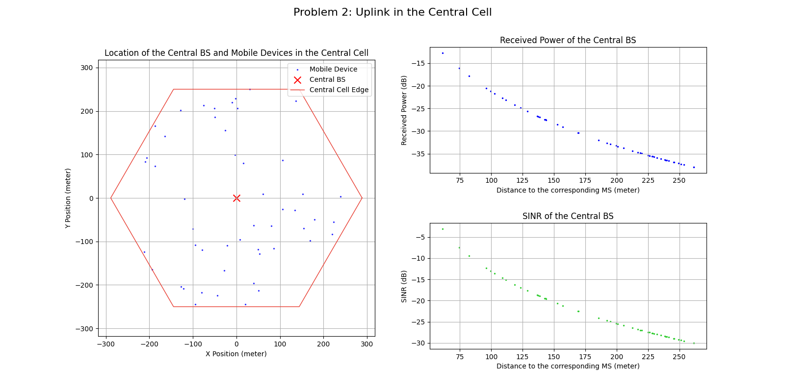
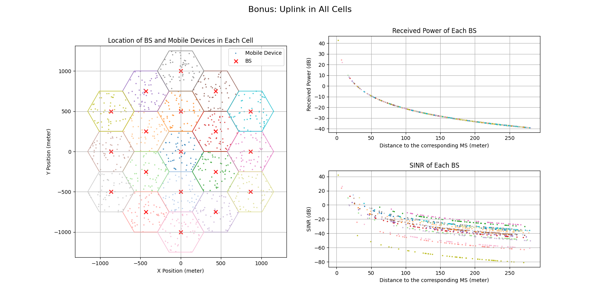

# HW2 Report

Let $N=19$ denote the number of cells, $M=50$ denote the number of mobile devices (MSs) per cell, $T=300$ denote the temperature (in Kelvin), $B=10^7$ denote the channel bandwidth (in Hz), $P_{BS}=10^{0.3}$ denote the power of each BS (in Watt), $P_{MS}=10^{-0.7}$ denote the power of each MS (in Watt), $G_T=10^{1.4}$ denote the transmitter antenna gain, $G_R=10^{1.4}$ denote the receiver antenna gain, $h_{BS}=51.5$ be the height above ground level of each BS (in meter), and $h_{MS}=1.5$ be the height above ground level of each MS (in meter).

Define the BSs by $BS_{1}, BS_{2}, \ldots, BS_{N}$, where $BS_1$ is the central BS. For $1\le i\le N$, define the $M$ MSs in the $i$th cell by $MS_{i,1}, MS_{i,2}, \ldots, MS_{i,M}$.

Let $\mathbf{x}_{i}$ be the coordinate of $BS_{i}$ and $\mathbf{y}_{i,j}$ be the coordinate of $MS_{i,j}$ for every $1\le i\le N, 1\le j\le M$. Note that $\mathbf{x}_1=(0,0)$.

Since the height of transmitter and receiver must be $h_{BS}$ and $h_{MS}$, the path-loss $g(d)$ according to two-ray-ground model is:
$$
g(d)=\dfrac{h_{BS}^2 h_{MS}^2}{d^4},
$$ 

where $d$ is the distance between the transmitter and the receiver.

Moreover, the thermal noise, denoted by $Noise$, is given by:
$$
Noise = kTB
$$
where $k$ is the Boltzmann constant.

For each problem $n$, there is only one resulting figure consisting of 3 graphs, where the graph for problem $n$-1 is on the left, $n$-2 is on the top right, and $n$-3 is on the bottom right.

## Problem 1

### 1-2
For $1\le i\le M$, the received power (in Watt) of $MS_{1, i}$, denoted by $P_{DL,MS_{1,i}}$, can be calculated by:
$$
P_{DL,MS_{1,i}} = P_{BS}\cdot G_T\cdot G_R \cdot g(||\mathbf{y}_{1,i}-\mathbf{x}_1||),
$$
which, in dBW, is $10\log_{10}{P_{DL,MS_{1,i}}}$.

### 1-3
For $1\le i\le M$, the SINR of $MS_{1, i}$, denoted by $SINR_{DL, MS_{1,i}}$, can be calculated by:
$$
SINR_{DL, MS_{1,i}} = \dfrac{P_{BS}G_T G_R \cdot g(||\mathbf{y}_{1,i}-\mathbf{x}_1||)}{Noise+\displaystyle\sum_{1\lt j\le N} P_{BS}G_TG_R \cdot g(||\mathbf{y}_{1,i}-\mathbf{x}_j||)},
$$
which, in dB, is $10\log_{10}{SINR_{DL, MS_{1,i}}}$.

## Problem 2

### 2-2
For $1\le i\le M$, the received power (in Watt) of $BS_1$ (the central BS) from $MS_{1, i}$, denoted by $P_{UL,MS_{1,i}}$, can be calculated by:
$$
P_{UL,MS_{1,i}} = P_{MS}\cdot G_T\cdot G_R \cdot g(||\mathbf{y}_{1,i}-\mathbf{x}_1||),
$$
which, in dBW, is $10\log_{10}{P_{UL,MS_{1,i}}}$.

### 2-3
For $1\le i\le M$, the SINR of $BS_1$ from $MS_{1, i}$, denoted by $SINR_{UL, MS_{1,i}}$, can be calculated by:
$$
SINR_{UL, MS_{1,i}} = \dfrac{P_{MS}G_T G_R \cdot g(||\mathbf{y}_{1,i}-\mathbf{x}_1||)}{Noise+\displaystyle\sum_{j\in \{1,\ldots, M\}\setminus \{i\}} P_{MS}G_TG_R \cdot g(||\mathbf{y}_{1,j}-\mathbf{x}_1||)},
$$
which, in dB, is $10\log_{10}{SINR_{UL, MS_{1,i}}}$.

## Bonus

### B-2
For $1\le i\le N$ and $1\le j\le M$, the received power (in Watt) of $BS_i$ from $MS_{i, j}$, denoted by $P_{UL,MS_{i,j}}$, can be calculated by:
$$
P_{UL,MS_{i,j}} = P_{MS}\cdot G_T\cdot G_R \cdot g(||\mathbf{y}_{i,j}-\mathbf{x}_i||),
$$
which, in dBW, is $10\log_{10}{P_{UL,MS_{i,j}}}$.

### B-3
For $1\le i\le N$ and $1\le j\le M$, the SINR of $BS_i$ from $MS_{i, j}$, denoted by $SINR'_{UL, MS_{i,j}}$, can be calculated by:
$$
SINR'_{UL, MS_{i,j}} = \dfrac{P_{MS}G_T G_R \cdot g(||\mathbf{y}_{i,j}-\mathbf{x}_i||)}{Noise+\displaystyle\sum_{(p,q)\in (\{1,\ldots, N\}\times \{1,\ldots, M\})\setminus \{(i,j)\}} P_{MS}G_TG_R \cdot g(||\mathbf{y}_{p,q}-\mathbf{x}_i||)},
$$
which, in dB, is $10\log_{10}{SINR'_{UL, MS_{i,j}}}$.

