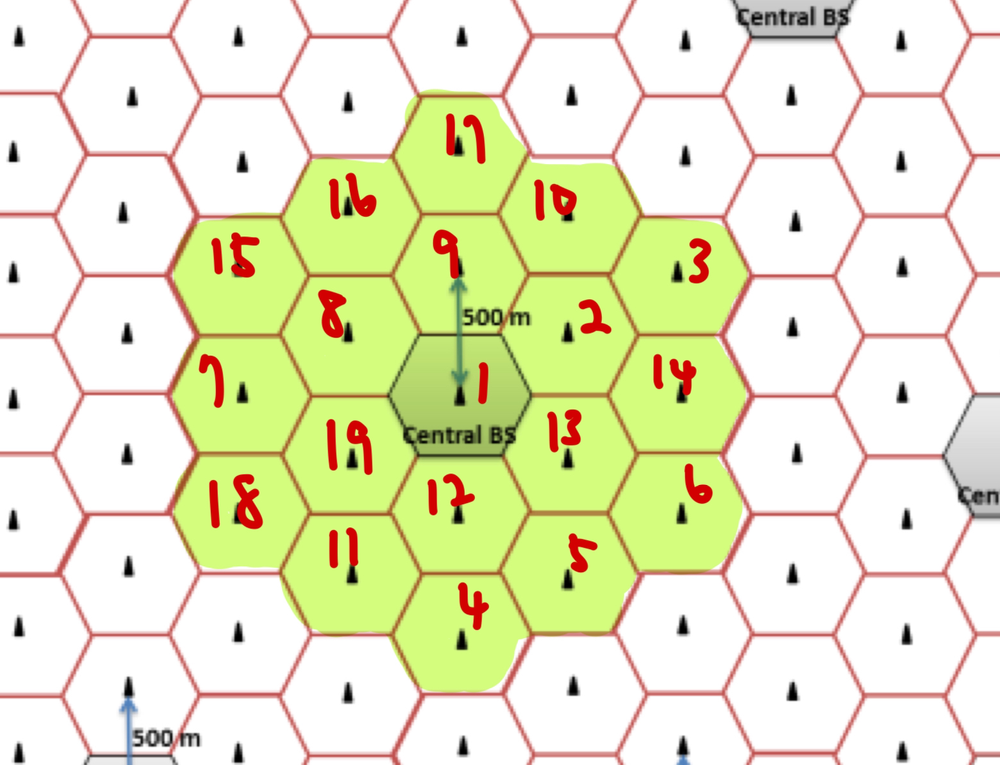
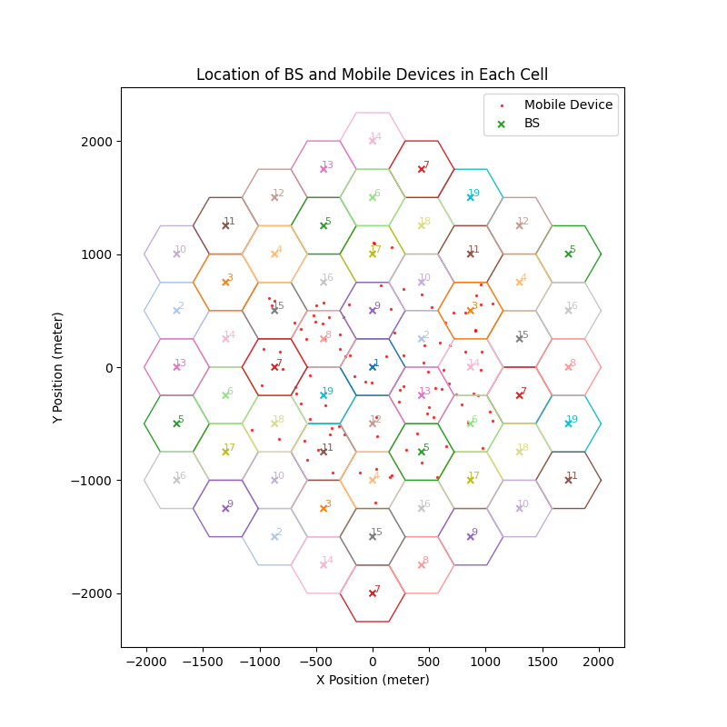

# HW3 Report

## Problem 1
### 1-1



### 1-2

+ The list of all handoff events is saved in `./q1_handoffs.csv` as it is too long to fit in the report.
+ The handoff criterion used in the simulation is SINR-based and is defined as follows:
    + For every mobile station $ms$, let $cell_t(ms)$ denote the cell where $ms$ is located at time $t$.
    + For every cell $c$, define by $N(c)$ the set of 19 closest cells to $c$, including $c$ itself.
    + Define the set of all considered (i.e., plotted) cells at time $t$:
        $$
        S_t = \left(\bigcup_{c\in \Lambda} N(c)\right) \cup \left(\bigcup_{ms\in MS} N(cell_t(ms))\right)
        $$
        where $\Lambda$ is the central 19 cells shown in Fig. 1 and $MS$ is the set of all mobile stations (even though there is only one mobile station).
    + At time $t$, for each mobile station $ms\in MS$, find the cell $c\in S_t$ such that the downlink SINR from the base station in $c$ to $ms$ is no less than the downlink SINR from the base station in any cell $c'\in S_t$ to $ms$. In cases where multiple cells $c$ meet this condition, one is chosen arbitrarily.
    + If the base station (BS) in $c$ is the same as the BS $ms$ was connected to at time $t-1$, no handoff is performed. (If $t=0$, then connect $ms$ to the BS in $c$.) Otherwise, perform a handoff from the previous connected cell to $c$.


### 1-3

$62$ handoff events happened during the total simulation time.

<div style="break-after:page;"></div>

## Bonus

### B-1


### B-2



The algorithm used to randomly generate a point in the central 19 cells, which is assigned to a cell as its initial location:
```c=
RandomPoint()
    l := ISD/sqrt(3)
    cell_id <- uniformly choose an integer in [0, 18]
    cell_center := the coordinate of the BS in cells[cell_id]
    v1, v2 <- uniformly choose 2 distinct vectors from the list 
                [(-l,0), (l/2,l/2*sqrt(3)), (l/2,-l/2*sqrt(3))]
    x1 <- uniformly choose a real number in [0, 1)
    x2 <- uniformly choose a real number in [0, 1)
    return cell_center + x1 * v1 + x2 * v2 
    // the multiplication (*) here is scalar multiplication 
```
In the pseudocode above, `ISD` represents the ISD (inter site distance) and `cells` is the array of the central 19 cells. 

### B-3

+ The list of all handoff events is saved in `./bonus_handoffs.csv` as it is too long to fit in the report.
+ The handoff criterion used in the simulation is SINR-based and is defined as follows:
    + For every mobile station $ms$, let $cell_t(ms)$ denote the cell where $ms$ is located at time $t$.
    + For every cell $c$, define by $N(c)$ the set of 19 closest cells to $c$, including $c$ itself.
    + Define the set of all considered (i.e., plotted) cells at time $t$:
        $$
        S_t = \left(\bigcup_{c\in \Lambda} N(c)\right) \cup \left(\bigcup_{ms\in MS} N(cell_t(ms))\right)
        $$
        where $\Lambda$ is the central 19 cells shown in Fig. 1 and $MS$ is the set of all mobile stations.
    + At time $t$, for each mobile station $ms\in MS$, find the cell $c\in S_t$ such that the uplink SINR from $ms$ to the base station in $c$ is no less than the uplink SINR from $ms$ to the base station in any cell $c'\in S_t$. In cases where multiple cells $c$ meet this condition (which should be extramely rare), one is chosen arbitrarily.
    + If the base station (BS) in $c$ is the same as the BS $ms$ was connected to at time $t-1$, no handoff is performed. (If $t=0$, then connect $ms$ to the BS in $c$.) Otherwise, perform a handoff from the previous connected cell to $c$.


### B-4

$5403$ handoff events happened during the total simulation time.

