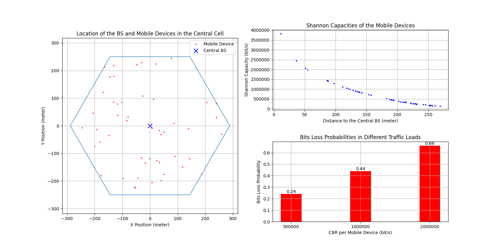

# HW4 Report

For each problem $n$, there is only one resulting figure consisting of 3 graphs, where the graph for problem $n$-1 is on the left, $n$-2 is on the top right, and $n$-3 is on the bottom right.

## Problem 1

### 1-2
Let $m_1, m_2, \ldots, m_{50}$ be the mobile devices in the central cell, and $b_1, b_2, \ldots, b_{19}$ be the 19 base stations, where $b_1$ is the central base station.

Let $\mathbf{x}_{i}$ be the coordinate of $b_{i}$ and $\mathbf{y}_{j}$ be the coordinate of $m_{j}$. Note that $\mathbf{x}_1=(0,0)$.

The Shannon capacity of $m_i$, denoted as $C_i$, can be calculated by:
$$
C_i = B\lg(1+\text{SINR}_i),
$$
where $B=\dfrac{10^7}{50}$ (Hz) is the channel bandwidth of each mobile device, and $\text{SINR}_i$ is the SINR of $m_i$.

In addition, $\text{SINR}_i$ can be calculated by:
$$
SINR_{i} = \dfrac{P_{b_1}G_T G_R \cdot g(||\mathbf{y}_{i}-\mathbf{x}_1||)}{k\cdot 300.15 \cdot B+\displaystyle\sum_{1\lt j\le 19} P_{b_j}G_TG_R \cdot g(||\mathbf{y}_{i}-\mathbf{x}_j||)}.
$$

### 1-3

$X_l = 5\cdot 10^5 (\text{bit/s}), X_m = 10^6 (\text{bit/s}), X_h = 2\cdot 10^6 (\text{bit/s})$

